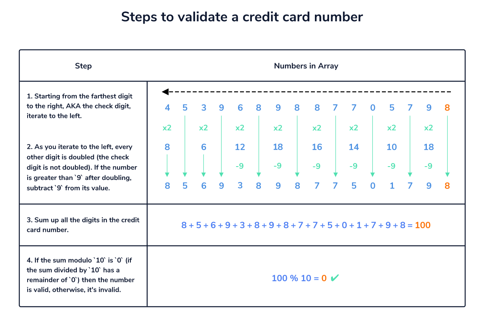
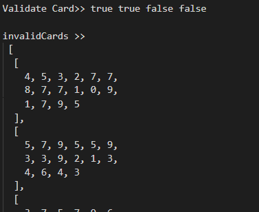

# cardValidator

## Table of Contents

* [Description](#description)
* [Screenshots](#screenshots)
* [Usage](#usage)
* [Questions](#questions)

## Description

Uses the Luhn Algorithm to check for card validation and if invalid check to see which card company insued an invalid card.

## Screenshots

## Usage

run the file in your code

## Questions

If you have further projects and questions, you can find me on Github: [GITHUB](https://github.com/benimahat1291). 
please visit my portfolio to find contact information: [BENI MAHAT](https://benimahat1291.github.io/Portfolio_v2/#/). 
